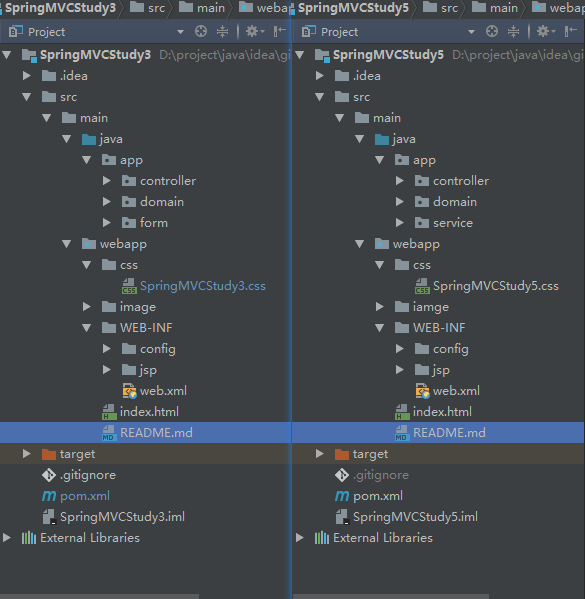
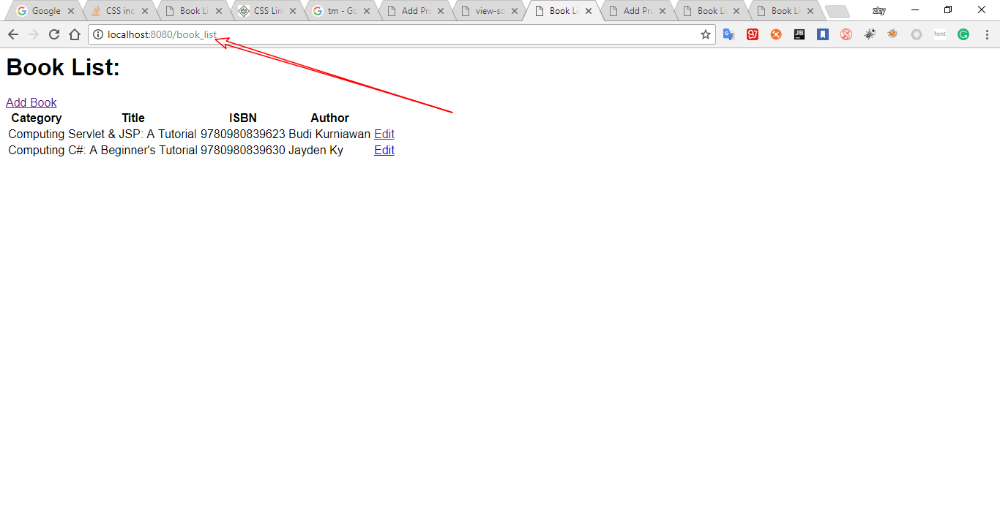
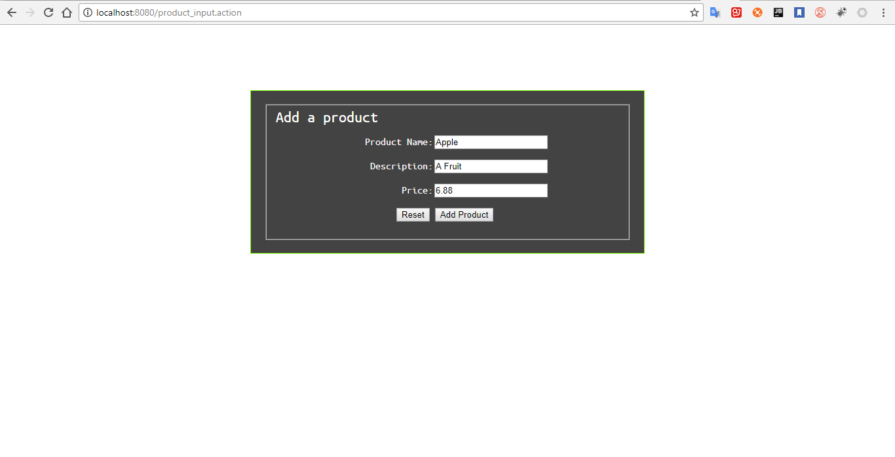

# 说明
- 这是SpringMVC的第五个练习
  - 主要是表单和标签的练习
  - 依然是基于注解形式的。
- 启动项目会自动定位到静态资源index.html
  - 请求地址http://localhost:8080/book_list到达页面1 如图image目录中的1.png.
  - 其他的在image目录中的2.png,3.png,4.png,5.png,6.png,7.png 分别是对应操作的截图
  他们的共同点就是都没有样式设置原因是放在webapp中的css中的SpringMVCStudy5.css无法加载到页面。
    - 尝试了以下几种方法只有一种办法可行。
      -     （不行）
      -     <link rel="stylesheet" type="text/css" href="../../css/SpringMVCStudy5.css" charset="UTF-8">（不行）
      -     <link rel="stylesheet" type="text/css" href="${pageContext.request.contextPath}/css/SpringMVCStudy5.css" charset="UTF-8"> （不行）
      -     （只有这种直接在页面中引用的方法管用）
- 同样都是maven应用，SrpingMVCStudy5和SpringMVCStudy3项目目录结构完全一致如图

但是SpringMVCStudy5应用的css样式却无法正常的加载，而SpringMVCStudy3应用的css样式却可以正常加载。
如 和

- 暂时想不明白这个问题，待以后慢慢解决。css样式的格式是正确的，页面和css的编码也都是utf-8编码